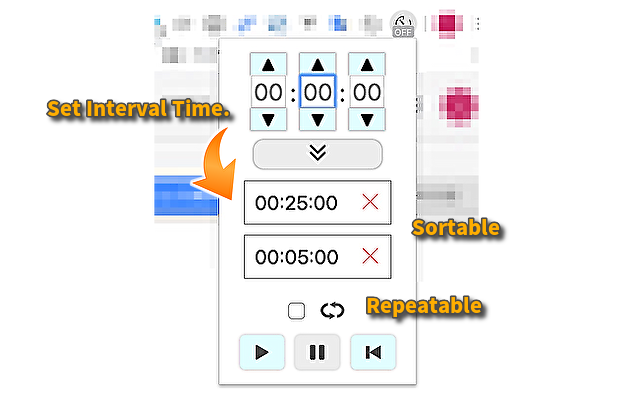

# Interval Timer for Chrome Extensions

## Usage


## Install

https://chrome.google.com/webstore/detail/interval-timer/ggofbbndaeneibofhcakocmknlcoleaa

## Develop

### Install Package
```
npm install
```

### Watch and build
```
npm run dev:chrome
```

### Build extension
```
npm run build:chrome
```


## Docs
[generator-chrome-extension-kickstart](https://github.com/HaNdTriX/generator-chrome-extension-kickstart)   
